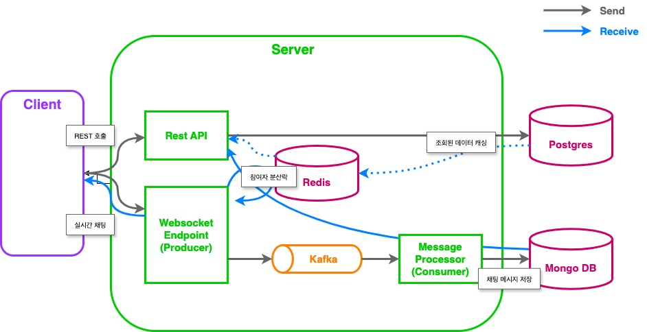

# 실시간 채팅 시스템

웹과 모바일 플랫폼에서 1:1 및 그룹 채팅을 지원하는 확장 가능한 실시간 채팅 시스템입니다.


## 시스템 개요

### 주요 기능
- 실시간 채팅 지원 (1:1, 그룹)
- 웹/앱 크로스 플랫폼 지원
- 사용자 접속 상태 확인
- 채팅 이력 관리
- 실시간 메시지 전송

### 제약 사항
- 그룹 채팅 최대 인원: 100명
- 메시지 타입: 텍스트 전용
- 메시지 길이: 최대 1,000자


## 기술 스택

### API(Backend)
- 언어: Kotlin 1.9.25
- 프레임워크: Spring Boot 3
- 빌드 도구: Gradle 8.10
- 데이터베이스: Postgres SQL, Mongo DB, Redis
- ORM: Spring Data JPA
- 메시지전송: Kafka(Avro)
- API 문서화: Swagger (SpringDoc OpenAPI)
- 테스트: Junit, Mockk
- 컨테이너: Docker(Docker Compose)

### Frontend
- 언어: node21 (설치: https://nodejs.org/en/download/prebuilt-installer)
- 프레임워크: vue3
- 빌드 도구: vite, npm
    - node 설치 시 npm도 함께 설치됩니다.


## 프로젝트 구조

### 백엔드 (Kotlin/Spring Boot)
```
.
├── src
│   ├── main
│   │   ├── kotlin
│   │   │   └── com.chat.homework
│   │   │       ├── common           # 공통 유틸리티 및 설정
│   │   │       │   ├── application
│   │   │       │   ├── aspect
│   │   │       │   ├── config
│   │   │       │   ├── domain
│   │   │       │   ├── dto
│   │   │       │   └── handler
│   │   │       ├── member           # 사용자 관리
│   │   │       │   ├── application
│   │   │       │   │   ├── dto
│   │   │       │   │   └── impl
│   │   │       │   ├── domain
│   │   │       │   ├── repository
│   │   │       │   └── ui
│   │   │       ├── message          # 메시지 처리
│   │   │       │   ├── application
│   │   │       │   ├── domain
│   │   │       │   ├── repository
│   │   │       │   └── ui
│   │   │       └── room            # 채팅방 관리
│   │   │           ├── application
│   │   │           ├── domain
│   │   │           ├── repository
│   │   │           └── ui
│   │   └── resources
│   │       ├── db.migration
│   │       └── application.yml
│   └── test
│       └── kotlin
│           └── com.chat.homework
│               ├── common
│               ├── member
│               ├── message
│               └── room
├── build.gradle.kts
└── docker-compose.yml
```

### 프론트엔드 (Vue.js)
```
web
├── src
│   ├── assets
│   ├── components     # 컴포넌트
│   ├── router
│   ├── stores         # 상태 관리
│   ├── types
│   ├── views          # 페이지 컴포넌트
│   ├── App.vue
│   └── main.ts
├── .env
├── Dockerfile
├── eslint.config.js
├── index.html
├── package.json
├── tsconfig.json
└── vite.config.ts
```


## 아키텍처




## 주요 코드 설명

### 엔티티 클래스
- 도메인 주도 설계 원칙 적용
- id 값을 제외한 프로퍼티는 원시타입이 아닌 Wrapper Class로 생성하여 재사용성을 높이도록 했습니다.
- Wrapper Class에서 유효성검사 기능을 활용하여 불변성을 보장하고, 유효성검사를 활용하여 Type-safety 합니다.
- 공용 검증 로직 인터페이스(`StringValidator`)를 활용하고 있습니다.

### Command, Query 분리
- 상태 변경 로직과 조회 로직을 분리하였습니다.
- Command, Query는 각기 다른 DB를 사용할 수 있습니다.
    - e.g. Command: MySQL, PostgreSQL / Query: Redis, Elasticsearch, MongoDB
    - `다른 방안`: 조회 성능을 향상시키고, 원본 테이블의 부하를 줄이기 위해 Materialized View를 활용하는 방법도 있습니다. 

### 채팅방 입장/퇴장, 참여자 목록 갱신 - RoomCommandService
- 클라이언트가 채팅방에 입장/퇴장 시, Websocket 통신으로 이벤트를 알립니다.
- 분산락으로 동시성을 제어한 후, Redis에 데이터를 갱신합니다.
- 갱신된 데이터로 각 클라이언트에 전파합니다.

### 실시간 채팅 메시지 저장 - MessageCommandService
- 채팅 메시지를 Websocket 통신으로 전달합니다.
- Kafka Producer/Consumer가 Queue의 역할을 하여 DB 부하를 방지하고, 메시지 저장 프로세서를 분리 확장 가능합니다.
  - Producer/Consumer 간 Schema Registry(Avro)를 사용하여 데이터 구조를 정의하고 관리합니다.
- 코루틴을 활용하여 비동기로 채팅 메시지를 각 클라이언트에 전파합니다.
- 채팅 메시지는 암호화/복호화(AES알고리즘) 합니다.
  - 관련 클래스: EncryptionUtil, EncryptionKeyProvider, MongoConfig

### DB 마이그레이션
- `Flyway`로 변경 이력을 관리합니다.
- 충돌없이 DB 변경사항을 공유할 수 있습니다.


## 실행 방법

1. 프로젝트를 클론합니다:
   ```
   git clone git@github.com:jxin19/chat.git
   cd [project-directory]
   ```

2. Docker Compose를 사용하여 필요한 서비스를 실행합니다:`docker-compose up -d`
    - 다음 컨테이너를 실행합니다.
      - Postgres SQL
      - Mongo DB
      - Redis
      - Kafka, Zookeeper, Schema Registry, Kafka UI(Optional)
      - API Application
      - Web Application(Vue3)
    - 실행된 Web 애플리케이션(컨테이너)은 http://localhost:5173 에 접속하여 확인할 수 있습니다.
    - 실행된 API 애플리케이션(컨테이너)은 http://localhost:8080 입니다.
    - 다음 3,4번 절차는 Docker를 실행하지 않고 애플리케이션을 실행하는 절차입니다.


3. API 애플리케이션을 빌드하고 실행합니다:

   `./gradlew bootRun`
    - 애플리케이션은 http://localhost:8080 에서 실행됩니다.


4. Web 애플리케이션을 실행합니다:

    ```
    cd web
    npm install
    npm run dev
    ```
    - 애플리케이션은 http://localhost:5173 에서 실행됩니다.
    - `npm run dev`가 실행되지 않는다면, `/usr/local/bin/npm run dev` 명령어로 실행할 수 있습니다.


## 테스트 실행

`./gradlew test`


## API 문서
애플리케이션 실행 후 http://localhost:8080/swagger-ui.html 에서 Swagger UI를 통해 API 문서를 확인할 수 있습니다.
